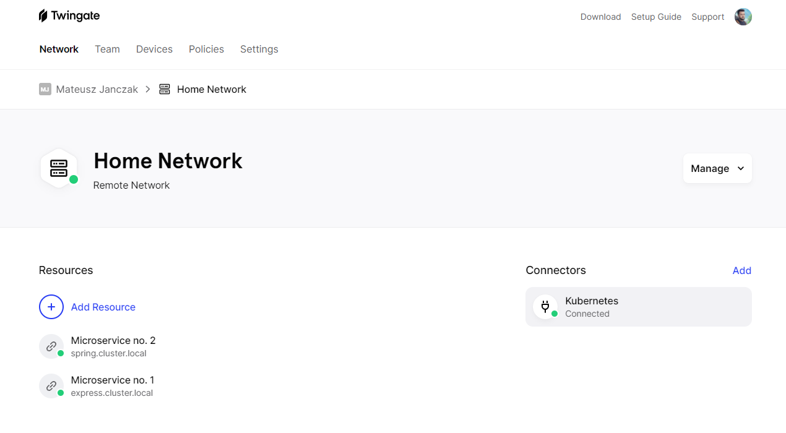
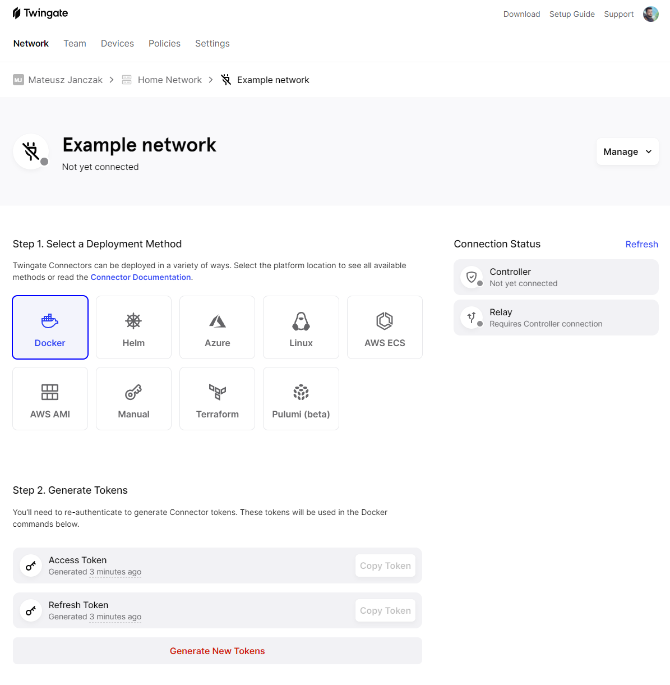
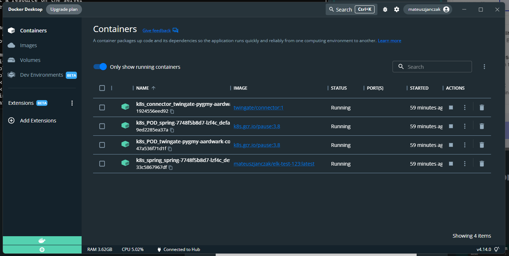
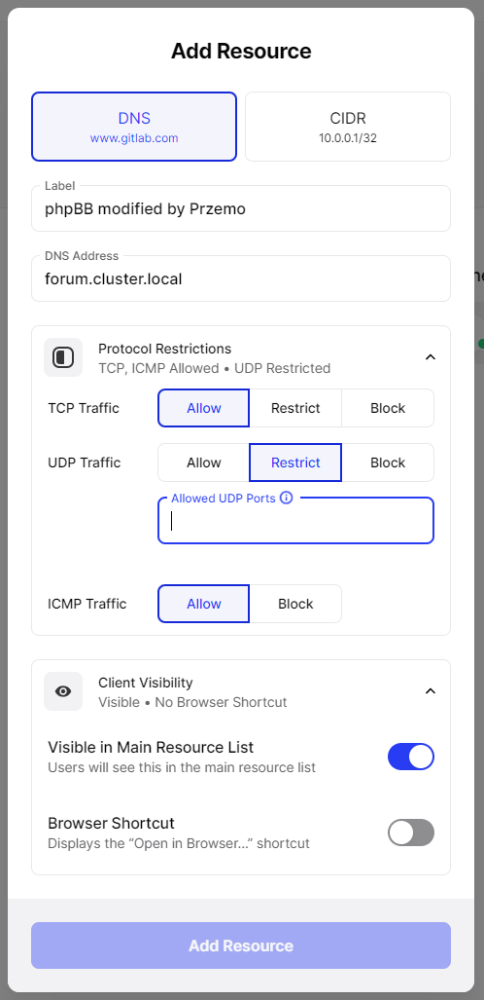
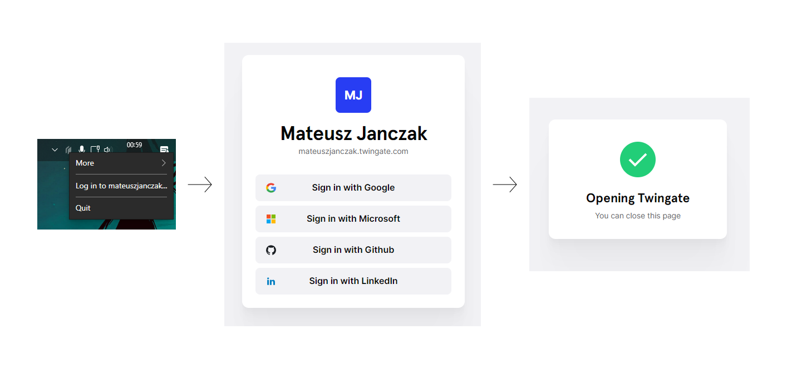

# Twingate

Remote access to private resources and networks

# Use case

Setup virtual private network inside home kubernetes cluster and expose it outside without port-forwarding.

# Home

# Deploy network

# Add resource

# Authentication

